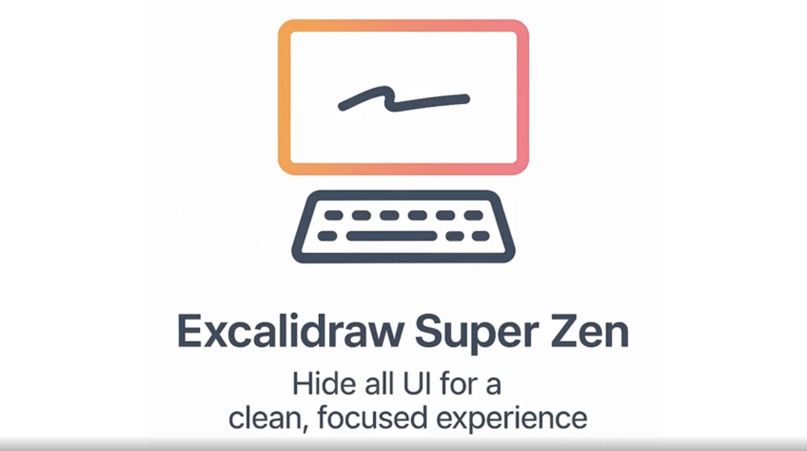
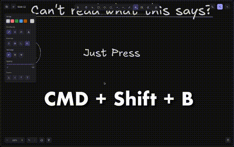

# Preview

# Buy Me a Coffee

Support the development and this and future tools and apps by buying me a coffee! All proceeds will go towards development of future tools, directly or indirectly.

https://patreon.com/SwarnimKalden?utm_source=github

If you can't help financially, staring this repo helps out too by getting more eyes on this project!

# Features

- 🧘‍♂️ Hide all UI instantly
- ⚡ Toggle with Cmd/Ctrl+Shift+B
- 📝 Shortcuts cheatsheet in help
- 🔄 Syncs state across all tabs
- 🖥️ Responsively adapts to UI changes and window sizing
- 🪟 Works on free & paid Excalidraw
- 🏃‍♂️ Hides UI through hydration and DOM changes
- 🔒 No tracking or analytics
- 🆓 Free & open source

# Installation

Firefox: https://addons.mozilla.org/en-US/firefox/addon/excalidraw-super-zen/
Chrome: Coming soon

# Useful Shortcuts Cheatsheet

| Shortcut        | Action                |
| --------------- | --------------------- |
| ?               | Help/Cheatsheet       |
| CMD + Shift + B | Super Zen (UI Toggle) |
| T               | Text                  |
| Esc             | Deselect (Mouse tool) |
| R               | Rectangle             |
| 5               | Arrow                 |
| 6               | Line                  |
| S               | Color Picker          |
| S -> B          | Color Red             |
| CMD + Shift + > | Increase Text Size    |
| CMD + Shift + < | Decrease Text Size    |
| `               | Toggle Sidebar        |

Knowing these will help you do most things without needing to re-show the UI, as that defeats some of the point of being able to hide the UI.

# TODOs

- [ ] Publish new version on firefox
- [ ] Publish on chrome
